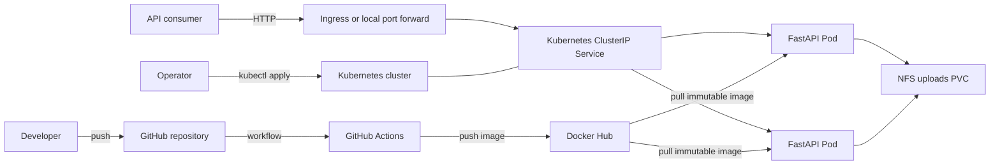
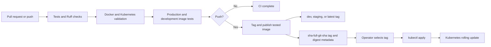

# FastShip Architecture

This document describes the architecture that exists in the repository today.
It is a living document: update it when a component, deployment boundary, or
operational responsibility changes. Planned capabilities are listed separately
and must not be interpreted as already implemented.

## Current status

FastShip is a small FastAPI service packaged as a Docker image. It can run
locally with Docker Compose and in production on Kubernetes. GitHub Actions
validates the application and publishes images to Docker Hub, while the
Kubernetes deployment is performed manually from a trusted workstation.

Kubernetes persists the simulated upload in an NFS-backed
PersistentVolumeClaim and exposes the API through an HTTP Ingress. The current
system does not include a database, message broker, DNS, TLS automation, or an
external secrets manager.

## System context



There are two distinct paths:

- The **request path** sends HTTP traffic through the Kubernetes Service to one
  of the application Pods.
- The **delivery path** tests and publishes an image in CI, then relies on an
  operator to select that image and apply the Kubernetes manifests.

GitHub-hosted runners do not have access to the Kubernetes cluster and do not
deploy the application.

## Application architecture

The application is a single Python process running FastAPI through Uvicorn on
port `8000`.

```text
src/main.py
  |-- application lifespan and state
  |-- GET /
  |-- /public immutable static files
  |-- /uploads simulated user uploads
  |-- health router
  |-- items router
  `-- test-rw router
```

The application currently provides:

- `GET /` for application metadata and the active environment.
- `GET /items/{item_id}` as an example API endpoint.
- `GET /health/startup`, `/health/live`, and `/health/ready` for Kubernetes
  probes.
- `/public/demo.txt` as an immutable file bundled into the image.
- `/uploads/uploaded.txt` for the on-demand file that represents a user upload.
- `POST /test-rw/uploads` to create or replace the simulated upload.
- `GET` and `PUT /test-rw/uploads` to read and append after it exists.
- `/docs` for the FastAPI-generated OpenAPI interface.

Lifecycle state is process-local and ephemeral. The simulated upload is stored
outside the container in Kubernetes and survives Pod replacement. The NFS
volume supports shared read/write access by replicas scheduled on different
nodes.

## Container architecture

The `Dockerfile` uses a multi-stage build:

1. The builder stage installs Poetry, exports dependencies, and installs them
   into `/opt/venv`.
2. The final stage copies only the virtual environment and application files
   into a smaller Python image.
3. The process runs as the unprivileged `appuser` user with UID and GID `10001`.
4. Uvicorn listens on `0.0.0.0:8000`.

The production image excludes Poetry, pytest, and other development-only
dependencies. Application and immutable static files are included in the
image, so a new image is required for every code or static-content release. The
image contains an empty writable `uploads` directory and does not seed user
data. The first successful upload PUT creates `uploaded.txt`. Staging and
production Compose checks write it to the container layer, so their changes
disappear when the container is replaced.

## Runtime environments

| Environment             | Runtime                                      | Exposure                     | Configuration                       |
|-------------------------|----------------------------------------------|------------------------------|-------------------------------------|
| Native development      | Poetry and Uvicorn                           | `localhost:8000`             | Local environment                   |
| Docker development      | Docker Compose with source mounts and reload | `localhost:5051`             | `APP_ENV=development`               |
| Docker staging check    | Docker Compose and published image           | `localhost:8001`             | `APP_ENV=staging`                   |
| Docker production check | Docker Compose and published image           | `localhost:8000`             | `APP_ENV=production`                |
| Kubernetes production   | Two Pods behind a ClusterIP Service          | Cluster-internal port `8000` | ConfigMap with `APP_ENV=production` |

Docker Compose is a local runtime convenience; it is not part of the
Kubernetes production topology.

## Kubernetes topology

The production manifests under `k8s/production` create five resources in the
current namespace and one cluster-scoped PersistentVolume:

| Resource              | Name                        | Responsibility                                                  |
|-----------------------|-----------------------------|-----------------------------------------------------------------|
| ConfigMap             | `fastship-app-api-config`    | Supplies non-sensitive application configuration                |
| PersistentVolume      | `fastship-app-uploads-nfs`   | Connects Kubernetes to the external NFS uploads export           |
| PersistentVolumeClaim | `fastship-app-uploads`       | Requests shared read/write storage for simulated uploads         |
| Deployment            | `fastship-app-api`           | Maintains two application replicas and performs rolling updates |
| Service               | `fastship-app-api-service`   | Provides stable, internal routing to ready Pods                  |
| Ingress               | `fastship-app-api`           | Routes ingress-controller HTTP traffic to the Service            |

The resources keep `app.kubernetes.io/name: fastship-app` as their shared
application identity. The Deployment selector, Pod labels, and Service selector
also use `app.kubernetes.io/instance: production` and
`app.kubernetes.io/component: api`, making the routing boundary explicit.

### Availability and lifecycle

- Two replicas provide process-level redundancy across schedulable nodes.
- Rolling updates allow one additional Pod and require existing replicas to
  remain available (`maxSurge: 1`, `maxUnavailable: 0`).
- The startup probe gives the process time to initialize.
- The readiness probe controls whether a Pod receives Service traffic.
- The liveness probe asks Kubernetes to restart a process that stops responding.
- A 30-second termination grace period permits orderly shutdown.

This improves availability within one cluster but does not provide
multi-cluster or multi-region disaster recovery.

### Resources and storage

Each Pod requests `100m` CPU and `128Mi` memory and is limited to `500m` CPU and
`256Mi` memory. With two replicas, the scheduler needs at least `200m` CPU and
`256Mi` memory for the requested application capacity, excluding platform
overhead.

The container root filesystem is read-only. A temporary `emptyDir` volume is
mounted at `/tmp`; its contents disappear when the Pod is replaced. Immutable
assets remain at `/home/appuser/public` in the image. The
`fastship-app-uploads` PersistentVolumeClaim is mounted at
`/home/appuser/uploads` and stores `uploaded.txt` after its first simulated
upload. No init container seeds that directory. The claim is statically bound
to the `fastship-app-uploads-nfs` PersistentVolume and uses `ReadWriteMany`, so
Pods on different nodes can share it. The NFS server remains an external
availability and backup dependency.

### Network exposure

The Service type is `ClusterIP`. An HTTP Ingress routes traffic from the
cluster's Ingress controller to that internal Service. The Ingress has no
hostname or TLS configuration, so it is intended only for temporary testing;
an operator can also use `kubectl port-forward`.

## Configuration and secrets

`APP_ENV` is the only application configuration currently supplied by
Kubernetes. It is non-sensitive and stored in a ConfigMap.

Docker Hub credentials are GitHub Actions secrets and are used only to publish
images. No runtime application secrets are required. If the image repository
becomes private, the cluster will also need a registry credential referenced by
the Pod through `imagePullSecrets`.

Sensitive values must not be added to the ConfigMap or committed to manifests.
A Kubernetes Secret or external secrets system should be introduced before the
application needs credentials.

## Delivery architecture

The workflow in `.github/workflows/fastship-app-ci-cd-docker.yml` runs for pull
requests and pushes involving `dev`, `staging`, or `main`, except
documentation-only changes. Only pushes publish images. The branch channel
mapping is `dev` to `dev`, `staging` to `staging`, and `main` to `latest`.



CI separates its responsibilities into three jobs:

- `quality` runs Python tests, linting, and formatting checks.
- `configuration` validates the Dockerfile, all Compose configurations, and the
  offline Kubernetes schema.
- `image` builds and tests the production and development images. On pushes it
  publishes the exact tested production image and its release metadata.

The detailed configuration, image-test, and publishing commands live in focused
scripts under `scripts/ci/`. The `image` job depends on both preceding jobs, so
publishing cannot begin unless every validation succeeds.

Pull requests do not receive Docker Hub credentials and cannot publish images.
Per-branch concurrency prevents older in-progress workflows from replacing a
newer channel tag.

Kubernetes production should use the immutable SHA tag published from `main`.
The operator records the selected version in `k8s/production/deployment.yaml`,
reviews the change, and applies it manually. The complete procedure is in the
[Kubernetes deployment runbook](kubernetes-deployment-runbook.md).

## Security posture

The current runtime applies these controls:

- The container runs as a fixed non-root user.
- Privilege escalation is disabled.
- Linux capabilities are dropped.
- The default runtime seccomp profile is enabled.
- The root filesystem is read-only.
- CPU and memory limits constrain resource consumption.
- The application container is reached through a ClusterIP Service and Ingress.

Current limitations include:

- Images are identified by immutable tags but are not pinned by digest.
- No image signing, provenance verification, or vulnerability-scanning policy
  is enforced by the cluster.
- Kubernetes RBAC, namespace policy, NetworkPolicy, and Pod security admission
  are managed outside this repository and are not documented yet.
- There is no application authentication or authorization layer.
- The Ingress does not configure a hostname, TLS, or an HTTPS redirect.
- The writable upload is served directly and is only a storage demonstration;
  no upload validation, content policy, or access control exists.

## Observability and operations

The application writes logs to the container's standard output and error
streams. Operators can inspect them with `kubectl logs`. Kubernetes uses the
three HTTP health endpoints for lifecycle management.

There is currently no centralized log aggregation, metrics endpoint, tracing,
alerting, dashboard, or service-level objective. Operational diagnosis relies
on Pod logs, resource status, and Kubernetes events as described in the
deployment runbook.

## Known boundaries

- The simulated upload depends on a single NFS server and is not resilient to
  that server becoming unavailable.
- The production deployment targets one Kubernetes cluster and the current
  kubectl namespace.
- Releases require a manual manifest update and `kubectl apply`.
- Rollback uses Kubernetes rollout history and must be reconciled back into the
  manifest afterward.
- Scaling is fixed at two replicas; no HorizontalPodAutoscaler is configured.
- DNS and certificate management are intentionally out of scope for the current
  basic HTTP Ingress.

## Evolution backlog

The next architecture changes should be documented when their requirements are
known. Likely additions are:

1. Introduce a namespace and environment-specific configuration strategy.
2. Add DNS and TLS to the existing Ingress for controlled public access.
3. Add centralized metrics, logs, dashboards, and alerts.
4. Add runtime secrets management when the first sensitive dependency appears.
5. Add NetworkPolicy and document cluster RBAC and Pod security requirements.
6. Automate deployment promotion after the manual process is well understood.
7. Add autoscaling only after real resource and traffic measurements exist.
8. Define backup and disaster-recovery behavior for the NFS uploads before
   treating them as production user data.

These are candidates, not commitments. Each addition should be driven by an
explicit requirement and captured in this document or in a separate
Architecture Decision Record when it introduces a meaningful trade-off.
Kubernetes environment isolation and automated digest promotion are explicitly
deferred to Phase 2; the Docker and CI foundation does not change the current
Kubernetes topology.

## Keeping this document current

Update this document in the same change that alters any of the following:

- Runtime components or external dependencies.
- Network boundaries or public exposure.
- Configuration, secrets, storage, or data ownership.
- Build, release, deployment, or rollback responsibilities.
- Availability, scaling, security, or observability controls.

Keep statements about the current system factual. Move completed items out of
the evolution backlog, and record significant design decisions under
`docs/decisions/` if Architecture Decision Records are introduced later.
