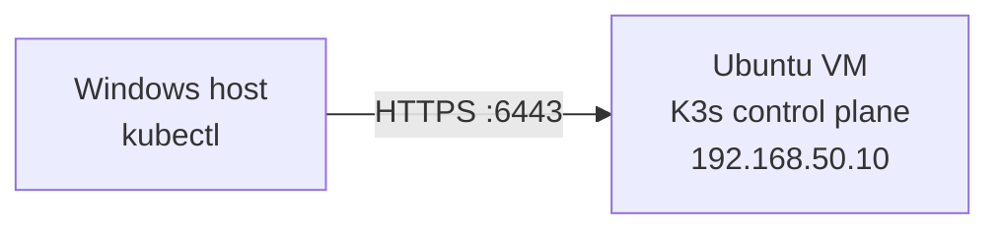

# Kubernetes Deployment Runbook

This runbook describes how to deploy FastShip to Kubernetes, verify the
release, update it, roll it back, and diagnose common failures.

## Deployment flow

The production release flow is:

1. Merge and push production application changes to the `main` branch.
2. GitHub Actions tests the application and container image.
3. GitHub Actions publishes `rezwanul7/fastship-app` to Docker Hub with both
   `latest` and an immutable `sha-<full-git-sha>` tag.
4. Set that immutable tag in `k8s/production/deployment.yaml`.
5. Apply the Kubernetes manifests and verify the rollout.

The manifests create two application replicas, a ConfigMap, an NFS-backed
PersistentVolume and `ReadWriteMany` PersistentVolumeClaim for the simulated
upload, an internal `ClusterIP` Service, and an HTTP Ingress. The
PersistentVolume is cluster-scoped; the other resources use the current
namespace. The Ingress requires an
Ingress controller already installed in the cluster. It currently has no
hostname or TLS configuration, so it can be reached through the controller's
external address for temporary testing. All commands below use the `default`
namespace unless `--namespace` or the current kubectl context says otherwise.

## Prerequisites

Before deploying, confirm that you have:

- Access to a running Kubernetes cluster.
- `kubectl` installed and configured for the target cluster.
- Permission to create Deployments, Services, ConfigMaps, Pods, and ReplicaSets.
- Permission to create cluster-scoped PersistentVolumes and namespaced
  PersistentVolumeClaims.
- An NFS server reachable from every schedulable node at `192.168.50.10:2049`,
  exporting `/srv/nfs/fastship-app-uploads` to every such node.
- NFS client utilities (`nfs-common` on Ubuntu) installed on every node.
- An installed and externally reachable Ingress controller.
- A successful image-publishing run in GitHub Actions.
- Access from the cluster to `docker.io/rezwanul7/fastship-app`.

The GitHub repository must contain these Actions secrets:

- `DOCKERHUB_USERNAME`
- `DOCKERHUB_ACCESS_TOKEN`

### Configure kubectl access from Windows

If K3s is running inside an Ubuntu VM but you want to manage the cluster from
your Windows host, Windows `kubectl` needs the credentials and API server
details stored in the K3s kubeconfig. The default kubeconfig points to
`127.0.0.1`, which refers to the VM itself, so copy the file to Windows and
replace that address with the control-plane VM's reachable IP.



K3s writes its admin kubeconfig to `/etc/rancher/k3s/k3s.yaml`. On the
control-plane VM, create a temporary user-readable copy:

```bash
sudo cp /etc/rancher/k3s/k3s.yaml "$HOME/k3s-lab.yaml"
sudo chown "$USER:$USER" "$HOME/k3s-lab.yaml"
chmod 600 "$HOME/k3s-lab.yaml"
```

From Windows PowerShell, copy it into the local kubeconfig directory:

```powershell
New-Item -ItemType Directory -Force "$env:USERPROFILE\.kube" | Out-Null
scp <user>@192.168.50.10:~/k3s-lab.yaml "$env:USERPROFILE\.kube\k3s-lab.yaml"
```

In the copied Windows file, change:

```text
server: https://127.0.0.1:6443
```

to:

```text
server: https://192.168.50.10:6443
```

With `kubectl` installed, run in Windows PowerShell:

```powershell
$env:KUBECONFIG = "$env:USERPROFILE\.kube\k3s-lab.yaml"
kubectl get nodes -o wide
```

The kubeconfig grants cluster-admin access. Keep it private and delete the
temporary copy from the Ubuntu user's home directory after the transfer.

Check the active cluster before making changes:

```shell
kubectl config current-context
kubectl cluster-info
kubectl get nodes
```

Do not continue if the current context points to the wrong cluster.

### Prepare the NFS export

The application runs with UID and GID `10001`. On the NFS server, make that
identity the owner of the uploads directory and keep `root_squash` enabled:

```bash
sudo chown 10001:10001 /srv/nfs/fastship-app-uploads
sudo chmod 0770 /srv/nfs/fastship-app-uploads
```

The export must authorize the IP of every node on which an application Pod can
run, not a Pod CIDR. The current lab documentation identifies the control plane
as `192.168.50.10`, while the reported export authorizes `192.168.50.11`.
Confirm the complete node list with `kubectl get nodes -o wide`, update
`/etc/exports` for all those node IPs, and then reload it:

```bash
sudo exportfs -rav
sudo exportfs -v
```

Before applying Kubernetes resources, test the export from each node:

```bash
sudo mkdir -p /mnt/fastship-app-uploads-test
sudo mount -t nfs4 192.168.50.10:/srv/nfs/fastship-app-uploads /mnt/fastship-app-uploads-test
sudo -u '#10001' touch /mnt/fastship-app-uploads-test/node-write-test
sudo -u '#10001' rm /mnt/fastship-app-uploads-test/node-write-test
sudo umount /mnt/fastship-app-uploads-test
```

If `ubuntu001` does not have `192.168.50.10`, change `spec.nfs.server` in
`k8s/production/persistent-volume.yaml` before applying the manifests.

## Publish a production image

Push the release commit to the production publishing branch:

```shell
git push origin main
```

Documentation-only pushes do not start the workflow. Wait for the **FastShip
Docker Build** workflow to succeed. It publishes these tags:

```text
rezwanul7/fastship-app:latest
rezwanul7/fastship-app:sha-<full-git-sha>
```

The workflow also uploads `release-metadata.json`, which records the immutable
tag and repository digest for the release.

Use the `sha-<full-git-sha>` tag for Kubernetes. Immutable tags make it clear
which code is running and make releases reproducible. The full SHA for the
checked-out commit is available with:

```shell
git rev-parse HEAD
```

## First deployment

### 1. Select the image

In `k8s/production/deployment.yaml`, replace:

```yaml
image: rezwanul7/fastship-app:sha-replace-with-full-git-sha
```

with the immutable tag published by the successful workflow, for example:

```yaml
image: rezwanul7/fastship-app:sha-0123456789abcdef0123456789abcdef01234567
```

Commit this manifest change so the repository records the deployed version.

### 2. Validate the manifests

Run client-side validation before changing the cluster:

```shell
kubectl apply --dry-run=client -f k8s/production
```

Review the rendered changes, especially for a shared or production cluster:

```shell
kubectl diff -f k8s/production
```

`kubectl diff` normally exits with status `1` when differences exist; that does
not mean validation failed.

### 3. Apply the manifests

```shell
kubectl apply -f k8s/production
kubectl rollout status deployment/fastship-app-api --timeout=120s
```

The rollout is successful when both replicas become available.

## Verify the deployment

Inspect the workload and Service:

```shell
kubectl get deployment,pods,service,pv,pvc
kubectl get deployment fastship-app-api -o jsonpath='{.spec.template.spec.containers[0].image}'
```

The expected state is:

- Deployment `fastship-app-api` reports `2/2` ready replicas.
- Both application Pods are `Running` and ready.
- Service `fastship-app-api-service` is a `ClusterIP` listening on port `8000`.
- Ingress `fastship-app-api` routes HTTP traffic to the internal Service.
- PV `fastship-app-uploads-nfs` and PVC `fastship-app-uploads` are `Bound`.
- The NFS claim is mounted at `/home/appuser/uploads` in both Pods.
- The Deployment image matches the selected immutable SHA tag.

Get the Ingress address and smoke-test it over HTTP:

```shell
kubectl get ingress fastship-app-api
curl http://<ingress-address>/health/startup
curl http://<ingress-address>/health/live
curl http://<ingress-address>/health/ready
curl http://<ingress-address>/
curl http://<ingress-address>/public/demo.txt
```

If the controller has not yet been assigned an address, or you are testing from
an environment that cannot reach it, forward the internal Service to the local
machine instead:

```shell
kubectl port-forward service/fastship-app-api-service 8000:8000
curl http://localhost:8000/health/startup
curl http://localhost:8000/health/live
curl http://localhost:8000/health/ready
curl http://localhost:8000/
curl http://localhost:8000/public/demo.txt
```

Interactive API documentation is available at <http://localhost:8000/docs>.

Verify shared writes through both replicas after creating an upload:

```shell
kubectl get pods -l app.kubernetes.io/name=fastship-app -o name
kubectl exec <first-pod-name> -- cat /home/appuser/uploads/uploaded.txt
kubectl exec <second-pod-name> -- cat /home/appuser/uploads/uploaded.txt
```

Before the first upload write, both upload requests must return HTTP 404:

```shell
curl --output /dev/null --silent --write-out '%{http_code}\n' \
  http://<ingress-address>/uploads/demo.txt
curl --output /dev/null --silent --write-out '%{http_code}\n' \
  http://<ingress-address>/uploads/uploaded.txt
curl http://<ingress-address>/test-rw/uploads
```

The last request returns a JSON error with detail `Uploaded file does not
exist`. Do not call the PUT endpoint during this check because its intended
behavior is to create `uploaded.txt`.

## Deploy a new version

For each release:

1. Wait for CI to publish the new `sha-<full-git-sha>` image.
2. Change the image tag in `k8s/production/deployment.yaml`.
3. Validate, review, and apply the manifests.
4. Wait for the rolling update and repeat the verification checks.

```shell
kubectl apply --dry-run=client -f k8s/production
kubectl diff -f k8s/production
kubectl apply -f k8s/production
kubectl rollout status deployment/fastship-app-api --timeout=120s
kubectl get pods
```

The rolling-update configuration keeps the existing replicas available while
the replacement Pods become ready.

## Roll back a release

View the Deployment's rollout history:

```shell
kubectl rollout history deployment/fastship-app-api
```

Undo the most recent rollout:

```shell
kubectl rollout undo deployment/fastship-app-api
kubectl rollout status deployment/fastship-app-api --timeout=120s
```

To restore a specific revision:

```shell
kubectl rollout undo deployment/fastship-app-api --to-revision=<revision-number>
```

After an emergency rollback, update `k8s/production/deployment.yaml` to the
restored image tag and commit it. Otherwise, the next `kubectl apply` will
reintroduce the newer tag from the repository.

## Troubleshooting

Start with these commands:

```shell
kubectl get pods
kubectl describe deployment fastship-app-api
kubectl describe pod <pod-name>
kubectl logs <pod-name>
kubectl get events --sort-by=.metadata.creationTimestamp
```

### `ImagePullBackOff` or `ErrImagePull`

- Confirm the full SHA tag exists in Docker Hub.
- Check the image name and tag in `k8s/production/deployment.yaml`.
- Confirm that cluster nodes can reach Docker Hub.
- If the Docker Hub repository is private, create a registry Secret in the same
  namespace and reference it through `imagePullSecrets` in the Pod template.

### `CrashLoopBackOff`

Read both the current and previous container logs:

```shell
kubectl logs <pod-name>
kubectl logs <pod-name> --previous
```

Also inspect the Pod events and exit code with `kubectl describe pod`.

### Readiness or liveness probe failures

The probes call `/health/startup`, `/health/ready`, and `/health/live` on port
`8000`. Check the Pod logs, then test a specific Pod directly:

```shell
kubectl port-forward pod/<pod-name> 8000:8000
curl http://localhost:8000/health/ready
```

### Rollout timeout

A timeout does not automatically remove the attempted release. Inspect the Pods
and events to find the cause. If the new release is faulty, use `kubectl rollout
undo` and verify the rollback.

## Ingress, DNS, and TLS

The current Ingress sends all HTTP requests it receives to the API Service and
does not specify a hostname. This permits temporary access through the Ingress
controller's address without DNS. It does not configure TLS, so do not send
sensitive traffic through this endpoint.

Before production use, add a hostname rule, point DNS at the controller's
external address, and configure a TLS certificate and HTTPS redirect. Those
settings are intentionally deferred because the exact configuration depends on
the cluster's Ingress controller and DNS provider.

## Deployment checklist

```shell
# Confirm the target cluster
kubectl config current-context
kubectl get nodes

# After setting the published SHA tag in deployment.yaml
kubectl apply --dry-run=client -f k8s/production
kubectl diff -f k8s/production
kubectl apply -f k8s/production

# Verify the release
kubectl rollout status deployment/fastship-app-api --timeout=120s
kubectl get deployment,pods,service,pv,pvc
kubectl get deployment fastship-app-api -o jsonpath='{.spec.template.spec.containers[0].image}'

# Smoke-test through the Ingress controller address
kubectl get ingress fastship-app-api
curl http://<ingress-address>/health/ready
```
